<div align="center">

# 🌍 AirSense Predictor

### *Breathe Informed, Live Better*

[](https://www.python.org/)
[](https://reactjs.org/)
[](https://flask.palletsprojects.com/)
[](https://www.typescriptlang.org/)
[](LICENSE)

**A cutting-edge Air Quality Index prediction system powered by Machine Learning**

[🚀 Quick Start](#-getting-started) • [📊 Features](#-features) • [🎯 Impact](#-why-it-matters) • [📖 Documentation](#-documentation)

---

</div>

## 🎯 Why It Matters

Air pollution is one of the world's leading environmental health risks, affecting millions globally. **AirSense Predictor** empowers individuals, communities, and policymakers with:

- **🏥 Health Protection** - Anticipate poor air quality days to protect vulnerable populations
- **📅 Smart Planning** - Make informed decisions about outdoor activities and travel
- **🌱 Environmental Awareness** - Track air quality trends and understand pollution patterns
- **🔬 Data-Driven Insights** - Leverage historical data for accurate future predictions

> *"Predicting air quality isn't just about numbers—it's about protecting lives and building healthier communities."*

## ✨ Features

<table>
<tr>
<td width="50%">

### 🤖 Intelligent Predictions
- **Random Forest ML Model** trained on 5 years of data
- **Multi-city Support** (Delhi, Mumbai, Bengaluru)
- **Monthly Forecasting** with confidence indicators
- **Real-time Processing** via Flask API

</td>
<td width="50%">

### 🎨 Beautiful Interface
- **Interactive Dashboard** with live charts
- **Responsive Design** for all devices
- **Dark/Light Themes** for comfortable viewing
- **Intuitive UX** with instant feedback

</td>
</tr>
<tr>
<td width="50%">

### 📈 Data Visualization
- **Historical Trends** analysis
- **Category Breakdown** with color coding
- **Comparative Charts** across time periods
- **Health Advisory** based on AQI levels

</td>
<td width="50%">

### ⚡ Performance
- **Lightning Fast** predictions (<1s response)
- **Optimized Backend** with efficient model loading
- **Modern Stack** (React 18 + Vite)
- **Production Ready** deployment guides

</td>
</tr>
</table>

## 🏗️ Architecture

```mermaid
graph LR
    A[👤 User] --> B[⚛️ React Frontend]
    B --> C[🔌 Flask API]
    C --> D[🤖 ML Model]
    D --> E[📊 Predictions]
    E --> B
    F[(📁 Historical Data)] --> D
```



<div align="center">

**Modern Tech Stack for Maximum Performance**

</div>

## 🛠️ Technology Stack

### Frontend Excellence
```
⚛️  React 18          - Modern UI framework
📘  TypeScript        - Type-safe development
⚡  Vite              - Lightning-fast build tool
🎨  Tailwind CSS      - Utility-first styling
🎭  shadcn/ui         - Beautiful components
📊  Recharts          - Data visualization
🔄  React Query       - Smart data fetching
```

### Backend Power
```
🐍  Python 3.8+       - Core language
🌶️  Flask 3.0         - Web framework
🤖  scikit-learn      - Machine learning
📊  pandas            - Data processing
🔢  NumPy             - Numerical computing
🔗  Flask-CORS        - API security
```

## 📊 Model Performance

Our Random Forest model delivers reliable predictions with:

- **Training Data**: 5 years (2020-2024) of real AQI measurements
- **Features**: 12 input parameters including historical pollutant averages
- **Cities**: 3 major Indian metropolitan areas
- **Accuracy**: Validated against historical patterns
- **Speed**: Sub-second prediction time

## 🚀 Getting Started

### ⚡ Quick Start (Windows)

Get up and running in under 2 minutes!

```bash
# 1️⃣ Clone the repository
git clone https://github.com/atharvax26/airsense-predictor.git
cd airsense-predictor

# 2️⃣ Install backend dependencies
install_backend.bat

# 3️⃣ Launch the application
run_simple.bat
```

**That's it!** 🎉 Your browser will automatically open to `http://localhost:8080`

> 💡 **Tip**: The batch file handles everything - backend startup, frontend launch, and browser opening!

---

### 🔧 Manual Setup (All Platforms)

<details>
<summary><b>📋 Prerequisites</b></summary>

- **Node.js** 18+ ([Download](https://nodejs.org/))
- **Python** 3.8+ ([Download](https://www.python.org/))
- **npm** (comes with Node.js)
- **pip** (comes with Python)

</details>

<details>
<summary><b>🐍 Backend Setup</b></summary>

```bash
# Navigate to backend directory
cd backend

# Install Python dependencies
pip install -r requirements.txt

# Start the Flask server
python app.py
```

✅ Backend running on `http://localhost:5000`

</details>

<details>
<summary><b>⚛️ Frontend Setup</b></summary>

```bash
# Navigate to project root
cd ..

# Install npm dependencies
npm install

# Create environment file
echo VITE_API_URL=http://localhost:5000 > .env

# Start the development server
npm run dev
```

✅ Frontend running on `http://localhost:8080`

</details>

---

## 🎮 Usage

### Making Your First Prediction

1. **Select a City** 🏙️
   - Choose from Delhi, Mumbai, or Bengaluru

2. **Pick a Time Period** 📅
   - Select year (2025+) and month (1-12)

3. **Get Prediction** 🔮
   - Click "Predict AQI" and see instant results

4. **Understand the Results** 📊
   - View AQI value with color-coded category
   - Read health advisory recommendations
   - Explore historical trends

### AQI Categories Explained

| AQI Range | Category | Color | Health Impact |
|-----------|----------|-------|---------------|
| 0-50 | 🟢 Good | Green | Minimal impact |
| 51-100 | 🟡 Satisfactory | Yellow | Minor breathing discomfort |
| 101-200 | 🟠 Moderate | Orange | Breathing discomfort for sensitive groups |
| 201-300 | 🔴 Poor | Red | Breathing discomfort for most people |
| 301-400 | 🟣 Very Poor | Purple | Respiratory illness on prolonged exposure |
| 400+ | 🟤 Severe | Maroon | Affects healthy people, serious impact |

---

## 🔌 API Reference

### Endpoints

#### `POST /predict`
Predict AQI for a specific city, year, and month.

**Request:**
```json
{
  "city": "Delhi",
  "year": 2025,
  "month": 6
}
```

**Response:**
```json
{
  "aqi": 156.23,
  "category": "Moderate",
  "city": "Delhi",
  "year": 2025,
  "month": 6
}
```

#### `GET /health`
Check API health status.

**Response:**
```json
{
  "status": "healthy"
}
```

#### `GET /stats`
Get comprehensive AQI statistics.

**Response:**
```json
{
  "latest": { "aqi": 145.2, "city": "Delhi", "date": "20 Feb 2026" },
  "historical_avg": { "aqi": 168.5, "period": "2020-2024" },
  "city_stats": [...],
  "total_records": 5840
}
```

---

## 🎨 Screenshots

<div align="center">

### Dashboard Overview
*Clean, intuitive interface with real-time predictions*

### Prediction Results
*Instant AQI predictions with health advisories*

### Historical Trends
*Interactive charts showing air quality patterns*

### Dark Mode
*Eye-friendly dark theme for comfortable viewing*

</div>

---

## 🌟 Key Highlights

### 🎯 Accuracy & Reliability
- Trained on **5 years** of real-world data
- **12 features** including historical pollutant averages
- Validated predictions against actual measurements

### ⚡ Performance
- **<1 second** prediction response time
- Optimized model loading and caching
- Efficient data processing pipeline

### 🔒 Security
- CORS-protected API endpoints
- Input validation and sanitization
- Environment-based configuration

### 📱 Accessibility
- Fully responsive design
- Screen reader compatible
- Keyboard navigation support
- WCAG guidelines considered

---

## 🧪 Testing

### Quick Test

```bash
# Test backend
curl http://localhost:5000/health

# Test prediction
curl -X POST http://localhost:5000/predict \
  -H "Content-Type: application/json" \
  -d '{"city":"Delhi","year":2025,"month":6}'
```

### Run Test Suite

```bash
# Frontend tests
npm test

# Backend tests (if implemented)
cd backend
pytest
```

---

## 🚢 Deployment

Deploy to production in minutes!

### Recommended Setup
- **Frontend**: Vercel (free tier)
- **Backend**: Render (free tier)

See [DEPLOYMENT.md](DEPLOYMENT.md) for detailed instructions.

---

## 📖 Documentation

| Document | Description |
|----------|-------------|
| [README.md](README.md) | You are here! |
| [QUICKSTART.md](QUICKSTART.md) | 5-minute setup guide |
| [BATCH_FILES_GUIDE.md](BATCH_FILES_GUIDE.md) | Windows automation scripts |
| [DEPLOYMENT.md](DEPLOYMENT.md) | Production deployment guide |

---

## 🤝 Contributing

We welcome contributions! Here's how you can help:

1. **🍴 Fork** the repository
2. **🌿 Create** a feature branch (`git checkout -b feature/AmazingFeature`)
3. **💾 Commit** your changes (`git commit -m 'Add some AmazingFeature'`)
4. **📤 Push** to the branch (`git push origin feature/AmazingFeature`)
5. **🎉 Open** a Pull Request

### Ideas for Contribution
- 🌍 Add more cities
- 📊 Improve ML model accuracy
- 🎨 Enhance UI/UX
- 📱 Build mobile app
- 🌐 Add internationalization
- 📈 Add more visualizations

---

## 🐛 Issues & Support

Found a bug? Have a suggestion?

- 🐛 [Report Bug](https://github.com/atharvax26/airsense-predictor/issues)
- 💡 [Request Feature](https://github.com/atharvax26/airsense-predictor/issues)
- 💬 [Ask Question](https://github.com/atharvax26/airsense-predictor/discussions)

---

## 📜 License

This project is licensed under the **MIT License** - see the [LICENSE](LICENSE) file for details.

---

## 🙏 Acknowledgments

- **Data Source**: Indian pollution monitoring stations
- **ML Framework**: scikit-learn community
- **UI Components**: shadcn/ui
- **Icons**: Lucide React
- **Inspiration**: The need for cleaner air and healthier communities

---

<div align="center">

### 🌟 Star this repo if you find it helpful!

**Made with ❤️ for a cleaner, healthier future**

[⬆ Back to Top](#-airsense-predictor)

</div>
